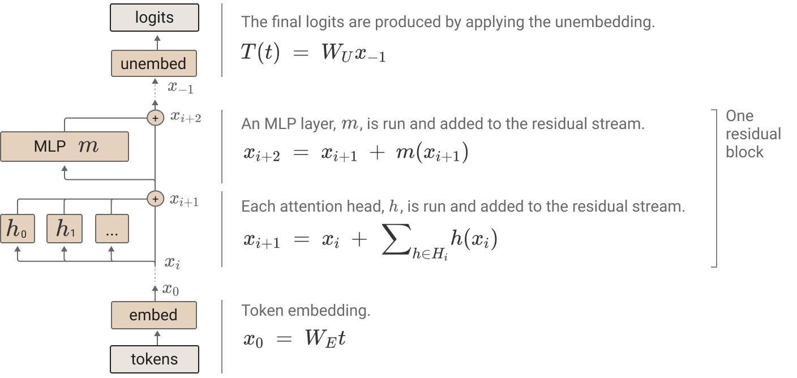
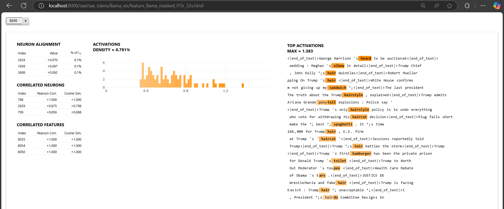
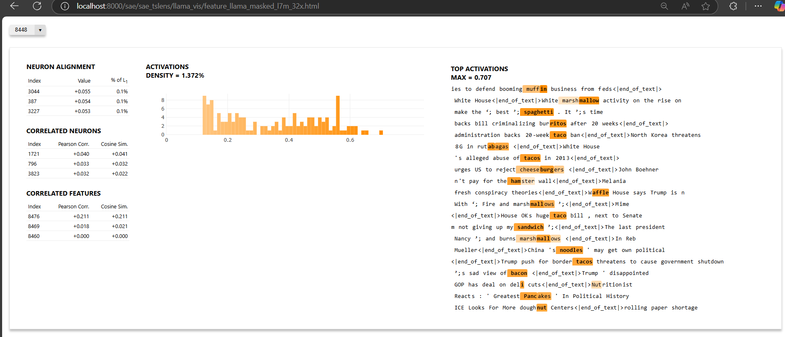
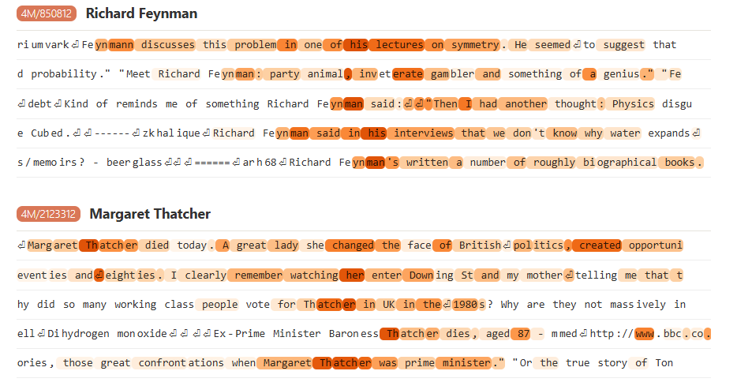

## Objective
When we started the SAE + humor data analysis, our objective is to identify features (singly, not combinations of features) that can be in aligned with the commonly seen humor topics. Inspired by Raskin's [Script-Based Semantic Theory of Humour (SSTH)](https://jonathansandling.com/script-based-semantic-theory-of-humour/), at the time we see some semantic categories where jokes occur:
 
- Actual (Non-Actual)
- Normal (Abnormal)
- Possible (Impossible)
- Good (Bad)
- Life (Death)
- Obscene (Non-Obscene)
- Money (No-Money)
- High Stature (Low Stature)

Looking at the humicroedit data statistics (summarized by the author, picked from their [paper](https://arxiv.org/pdf/1906.00274)), we further concretize the categories:
- Clothing
- Sexuality
- Food
- Fantasy
- Performance
- Bodily Function
- Animals
- Formality


Caption: The statistics of the humicroedit data, with the categories of humor scripts.


With sparse autoencoders popular for its ability of mechanistic interpretibility in analyzing model's layers, our objecitve is to see whether the activation values output from SAEs can have some correlation with the humorous topics. 


## Sparse Autoencoders and some technicalities

We utilized the SAEs trained on each layer of Llama-3.1-8B model, [technical details](https://arxiv.org/pdf/2410.20526) provided by the NLP Lab at Fudan University. These SAEs were trained on text data sampled from [SlimPajama (Soboleva et al., 2023)](https://cerebras.ai/blog/slimpajama-a-627b-token-cleaned-and-deduplicated-version-of-redpajama) with the proportions of each subset (e.g., Commoncrawl, C4, Github, Books, Arxiv, StackExchange) preserved. There are three positions in a transformer block on which the SAE were trained, specifically:
- Post-MLP Residual Stream (R): The residual stream output of the transformer block at a layer. (Denoted as $x_{i+2}$ in the below image)
- Attention Output (A): The output of each attention layer inside the transformer block. (Denoted as $\Sigma_{h\in H_i} h(x_{i})$ in the below image)
- MLP Output (M): The output of each MLP layer inside the transformer block. (Denoted as $m(x_{i})$ in the below image)


Caption: The three positions (mlp, attention and residual stream) in one transformer block. Original image is from NLP lab at Fudan University, who trained the LLaMa SAEs we are analyzing upon. The image is clipped from [their paper](https://arxiv.org/pdf/2410.20526).



Caption: The residual stream and its sub-components (attention and mlp) in one transformer block. Original image is from Anthropic blog, "[A Mathematical Framework for Transformer Circuits](https://transformer-circuits.pub/2021/framework/index.html)" (2021).


Recalling the basic architecture of an SAE, it consisted of an encoder mapping from a matrix of activation values to a sparse vector of dimension $d$; then a ReLU activation function applied to the sparse vector; finally a decoder mapping from the sparse vector to another matrix of activation values. Below is a simple diagram for understanding. as reference The sparse vector is an encoded representation of the input activation values. The second matrix of activation values is the "reconstructed" version of original matrix. 


Caption: Diagram of a sparse autoencoder. The intermediate activations are sparse, with only 2 nonzero values. Note that a relu function should be applied to the sparse vector, before applying the decoder, which is not shown in the diagram.The original image is from Adam Karvonen's blog, "[An Intuitive Explanation of Sparse Autoencoders for LLM Interpretability](https://adamkarvonen.github.io/machine_learning/2024/06/11/sae-intuitions.html)".

The authors who trained the llama SAEs picked $d$ to be a multiple of the hidden dimension of the hidden layer of the llama model. This constant factor, also called the *expansion factor* is 8 or 32 for each SAE. Specifically, by llama architecture, the input activation dimension is 4096, and the SAE’s encoded representation is a vector of length 32k (4096 x 8) or 128k (4096 x 32). Further take the expansion factor of 8 as an example. The encoder, i.e a matrix, is of shape (4096, 4096\*8) and the decoder, i.e another matrix, is of shape (4096\*8, 4096). Note that the encoder's input shape and decoder's output shape are the same, both are of 4096, which is again by design of SAE that aims to reconstruct the original activation values.

\~footnote{During SAE training, the loss was designed to encourage the sparsity of the vector (i.e, very few values out of $d$ values are non-zero), and encourage the reconstructed matrix to be as close as possible to the original matrix. The sparsity loss is an L1 loss, summing over all the elements in the vector. The reconstruction loss is an L2 loss, summing over the error between each individual element between the original and reconstructed matrices.}


Llama-3.1-8B consists of 32 layers, resulting in 96 (32 \* 3) possible training positions. For each position, there are two SAEs trained, each with a different expansion factor. Therefore, we totally have 96 \*2 = 192 SAE candidates available to analyze. Out of these, we picked 20 SAEs, across different layers, positions and expansion factors. In the below table, the cell with green tick marks indicate the SAE we analyzed. 

| Position             | Expansion Factor | Layer 7 | Layer 15 | Layer 16 | Layer 23 | Layer 24 | Layer 31 |
|----------------------|------------------|---------|----------|----------|----------|----------|----------|
| Attention Output (A) | 8x               | ✅[link](https://jychen630.github.io/llama_vis/feature_llama_masked_l7a_8x.html)       | ✅[link](https://jychen630.github.io/llama_vis/feature_llama_masked_l15a_8x.html)        | ✅[link](https://jychen630.github.io/llama_vis/feature_llama_masked_l16a_8x.html)        | ✅[link](https://jychen630.github.io/llama_vis/feature_llama_masked_l23a_8x.html)        | ✅[link](https://jychen630.github.io/llama_vis/feature_llama_masked_l24a_8x.html)        | ✅[link](https://jychen630.github.io/llama_vis/feature_llama_masked_l31a_8x.html)        |
|                      | 32x              | ✅[link](https://jychen630.github.io/llama_vis/feature_llama_masked_l7a_32x.html)       | ✅[link](https://jychen630.github.io/llama_vis/feature_llama_masked_l15a_32x.html)        | ✅[link](https://jychen630.github.io/llama_vis/feature_llama_masked_l16a_32x.html)        | ✅[link](https://jychen630.github.io/llama_vis/feature_llama_masked_l23a_32x.html)        | ✅[link](https://jychen630.github.io/llama_vis/feature_llama_masked_l24a_32x.html)        | ✅[link](https://jychen630.github.io/llama_vis/feature_llama_masked_l31a_32x.html)        |
| MLP Output (M)       | 8x               |         |          |          |          |          |          |
|                      | 32x              | ✅[link](https://jychen630.github.io/llama_vis/feature_llama_masked_l7m_32x.html)       | ✅[link](https://jychen630.github.io/llama_vis/feature_llama_masked_l15m_32x.html)        |          | ✅[link](https://jychen630.github.io/llama_vis/feature_llama_masked_l23m_32x.html)        |          | ✅[link](https://jychen630.github.io/llama_vis/feature_llama_masked_l31m_32x.html)        |
| Residual Stream (R)  | 8x               |         |          |          |          |          |          |
|                      | 32x              | ✅[link](https://jychen630.github.io/llama_vis/feature_llama_masked_l7r_32x.html)       | ✅[link](https://jychen630.github.io/llama_vis/feature_llama_masked_l15r_32x.html)        |          | ✅[link](https://jychen630.github.io/llama_vis/feature_llama_masked_l23r_32x.html)        |          | ✅[link](https://jychen630.github.io/llama_vis/feature_llama_masked_l31r_32x.html)        |


Each SAE's activation output were obtained when feeding the humicroedit data ([huggingface handle](https://huggingface.co/datasets/SemEvalWorkshop/humicroedit), [original paper with useful stats](https://arxiv.org/pdf/1906.00274)), originall from SemEval-2020 task 7 (assessing humor in edited news headlines), subtask-1 (given the original and the edited headline, predict the mean funniness of the edited headline). Each item, quoted below, consists of an original sentence with the edited position marked by `</>`, the edited word, and the 5 grades provided by human annotators. Higher mean grade (with max of 3, min of 1) indicates the sentence is "funnier". \~footnote{I'm personally not certain how to define "funniess", nor do I know how to map the sense of funniness to a numeric score. My intuition is that these edited sentences induce laughs from easier to harder, less to more mental efforts, or semantically, larger to small semantic/conceptual jumps. (A personal heuristic is that if there is no single-side strong feeling toward the thing, I may rate as 2. Otherwise I rate 1 or 3 correspondingly. Many times I was asked to rate a certain event on a scale from 1 to 5, I usually just throw a random number between 2 to 4 if I dont have strong feelings. It would be harder to rate on a scale from 1 to 10, as it's harder to articulate a more granular feeling numerically.)}

```
{
  'id': 1183,
  'original': 'Kushner to visit <Mexico/> following latest trump tirades.',
  'edit': 'therapist',
  'grades': '33332',
  'meanGrade': 2.8
}
```

Among these humicroedit data, we filtered out the items with meanGrade less than or equal to 2. The remaining data out of 9652 items is 630 (only 6.5% of them are considered quite funny!).

## Visualize the features & corresponding tokens

Below we describe the process ot getting the dashboards. Note that the process is done the same **for each feature** (at a position {a,m,r}, at a layer {0..31}, at an expansion factor {8x,32x}) **for each SAE**. (Toolings: [sae_dashboard (with my adaptations)](https://github.com/jychen630/sae_dashboard/commits/master/), [sae_vis](https://github.com/jychen630/sae_vis_study_notes), previous both leverages [sae_lens](https://github.com/jbloomAus/SAELens))

An activation value in the feature matrix corresponds to a token from the prompt. (Please look at the below pipeline figure to understand the details.) We masked out the activation values whose position are not in the edited text.

```
## First generate the mask (using two pointers: left pointer sweeps forward and right pointer sweeps backward and then sandwiched)
original (decoded): ['F', 'BI', ' Ra', 'ids', ' Office', ' Of', ' Trump', ' Law', 'yer', ' Michael', ' Cohen', ' :', ' Report']
original (len 13) [   40  5988 11291  2280  7258  4539  3653  5245  7678  6105 18981  1146 10557]
edited (decoded): ['F', 'BI', ' Red', 'ec', 'or', 'ates', ' Office', ' Of', ' Trump', ' Law', 'yer', ' Michael', ' Cohen', ' :', ' Report']
edited (len 15) [   40  5988  4270   878   264   682  7258  4539  3653  5245  7678  6105 18981  1146 10557]
mask (len 15): [False, False, True, True, True, True, False, False, False, False, False, False, False, False, False]

## Apply mask to activation values
mask: [False, False, True, True, True, True, False, False, False, False, False, False, False, False, False]
+
activation values: [0, 0.3, 0.5, 0.6, 0.1, 0, 0, 0, 0.2, 0.9, 0, 0, 0, 0, 0]
=
masked activation values: [0, 0, 0.5, 0.6, 0.1, 0, 0, 0, 0, 0, 0, 0, 0, 0, 0]
```


Caption: The pipeline generating the feature matrix at applying SAE with humor prompts.


Caption: The pipeline fetching the tokens corresponding to the (large) activation values, continuing from the previous figure.


We first sorted by their activation density, which is defined to be the number of non-zero values divided by the total number of values. For those features with activation density greater than 0.01, we stream the corresponding 20 centered tokens and their neighboring tokens to dashboard. So on dashboards, you should see a dropdown list, with first item the largest activation density. The number on the dropdown list of each feature is simply an index generated programmatically, which doesn't mean anything. Note that the sentences are concatenated together, so the analysis is done on a corpus level, and you should see some `<endoftext>` in the middle of the sentences.

We manually inspected the highlighted edited words for each feature for each SAE in a previously table shown with green ticks, starting from the feature with the highest activation density. Here we displayed several strong features manually found.


### Layer 7, Residual Stream, 32x expansion factor (i.e out of 128k features), feature id 1216
The majority (17/20) is about kids or childhood.

[leprechaun, circus\*5, bedtime, mommy, picnic, (break)dance, clown, (marsh)mallow, musical, (ch)ihu(ah)ua, (kind)ergarten, (sleep)over]


### Layer 7, Residual Stream, 32x expansion factor (i.e out of 128k features), feature id 9920
All (20/20) about sex/sexual activities/sexual organs/sexual connotations

[bed, (sexual )toy, (cop)ulate, urinate, (test)icles, (haemorh)oid, (s)perm, bra, underwear, diarrhea, brothel, grope, diaper, anal]


### Layer 7, Residual Stream, 32x expansion factor (i.e out of 128k features), feature id 14080

Half (10/20) about animals.

[puppy\*2, puppies, chimpan(ze)es, (par)rots, (plat)ypus\*2, (uni)corns, (deodor)ant, monkeys]


### Layer 23, Attention Output, 8x expansion factor (i.e out of 32k features), feature id 13056 

More than half (12/20) about beautfy and fashion.

[wife, haircut\*2, cactus, hair, shampoo, (compl)iment, underwear, mom, fashion, barber, hairdo]


### Layer 31, Attention Output, 8x expansion factor (i.e out of 32k features), feature id 5696

Weakly, nearly half (9/20) about health or bodily functions.

[urinate, (nut)ritionist, (g)ynecologist\*2, sneeze\*2, moustache, testicles, tanning]
   


### Layer 15, Residual Stream, 32x expansion factor (i.e out of 128k features), feature id 8000

The majority (16/20) about bodily functions.

[beard, elbow, hair\*6, ponytail, hairstyle\*2, haircut\*2, (e)ars, toupee, hairdo ]


### Layer 7, MLP Output, 32x expansion factor (i.e out of 128k features), feature id 8448

All (20/20) about food, though one of them is actually *ham*ster* with *ham* comes with higher activation value.

[muffin, marshmallow\*2, spaghetti, (bur)ritos, taco, (rut)abages, tacos\*2, cheeseburgers, hamster, (w)affle, noodles, bacon, (del)i, pancakes, nut, (dough)nut]



---

Below are some unrelated features found, just to throw some here, not indicate any semantics though

### Layer 23, Residual Stream, 32x expansion factor (i.e out of 128k features), feature id 6528

All (20/20) words started with character "c" - though not indicate any semantics.


### Layer 15, Residual Stream, 32x expansion factor (i.e out of 128k features), feature id 13952

All (20/20) words started with character "s" - though not indicate any semantics.


### Layer 15, Residual Stream, 32x expansion factor (i.e out of 128k features), feature id 6272

All (20/20) words ended with character "ing" - though not indicate any semantics.


## Subjectivity in concept extraction
If our goal is to, say, find concepts that are singular in nature, distinct and non-combinatorial, rather tan mixed or overlapping with multiple unrelated ideas, the short answer is yes, there are a few you can pick. The majority of the top features are combinatorial. One may see half of the highlighted edited words is 'related to sex' , 14 with 'food' and the rest about random concepts from a top feature with 20 sentences displayed on the dashboard. It's subjective in concept extraction: the identification may vary between individuals. What I interpret as ‘combination of concepts' can be seen differently by another person, who would extract a singular concepts out of that.

Relevantly, we wonder in anthropic's work "[Scaling Monosemanticity](https://transformer-circuits.pub/2024/scaling-monosemanticity/), do they manually extract the concepts out of the sentences? Also, in this display, did they manually throw away some other sentences that are not highly relevant to 'canada' out of many candidate aggregated sentences? Let say we have 20 sentences on the dashboard, 17 out of 20 are about animals, and 3 about food, in the final representation when we brag the result to someone else, can we throw away the 3 and then claim this group is an 'animal' group?


Caption: Country features by Anthropic.



Caption: Famous people features by Anthropic.

In humicroedit data [paper](https://arxiv.org/pdf/1906.00274), see the table caption - the categories are also very subjective. these concepts are one slice/lens out of all concepts in the universe. \~footnote{I think in my mind in general, it's quite intriguing to do a "concept identification/extraction" task}


## Floating questions regarding the SAE + Humor direction given current results

0. Can trian a simple classifier on the activation values for edited and original, suggested by Zach? TODO.
1. Can the absolute values of activation values from SAE tell us anything?
2. Out of many features (imagine 192 candidates, with each we picked a handful of top features, there can be a thousand of them), how do we (a) efficiently identify semantic concepts; (b) for those that represent a combination of concepts (not just single concept like I displayed above), do they tell us anything meaningful, or how are we entitled to throw them away?
3. A discussion on explanability: Given that the 630 sentences with meanGrade > 2.0 in our dataset are haevily clustered around the topics in [clothes and fashion, sex, food, eating, fantasy characters, music and shows, bodily functions, animals, jobs and roes...] (stats provided by the data collector), the highlighted words will *naturally* fall within these. We neither dont have the evidence (yet) to say the non-highlighted words do not fall into these topics and thus imply that they may not induce humor; nor we have the evidence to say the highlighted words are the only ones that induce humor. Additionally, we throwed away sentences with meanGrade <= 2.0, which consist of 93%+ of the data. We dont have SAE analysis at these data either. Right now we only do a non-rigorous sanity check, saying that *there might exist some features that perhaps related to humorous text*, neither sufficiently nor necessarily.
4. A discussion regarding to the generalizability of the features found, in addition to the explanability above: let say we find a particular strong feature, $f$, so what? Can it generalize to other texts? If so, how to verify that? Also, can we find more strong, generalizable features, given one successful instance $f$?
5. Recall that our SAE utilized are originally trained on SlimPajama dataset, with proportions of each subset (e.g., Commoncrawl, C4, Github, Books, Arxiv, StackExchange) preserved. How should I think about the influence that these datasets trained on will have on the features found, and on the humor-related features found?
